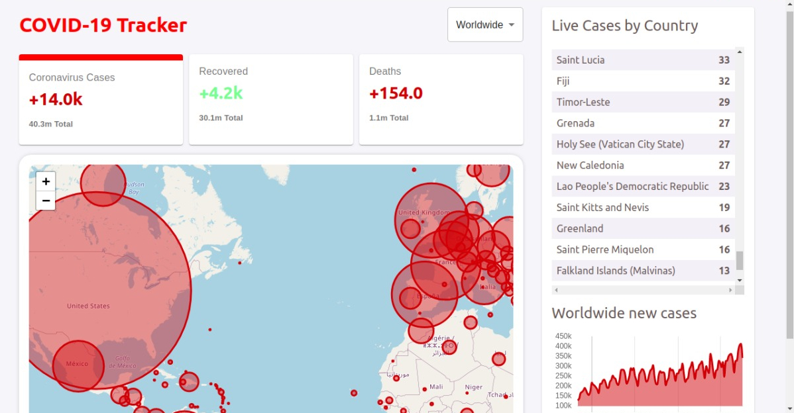
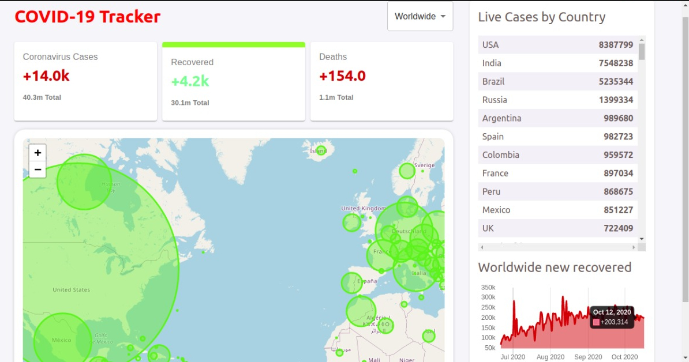
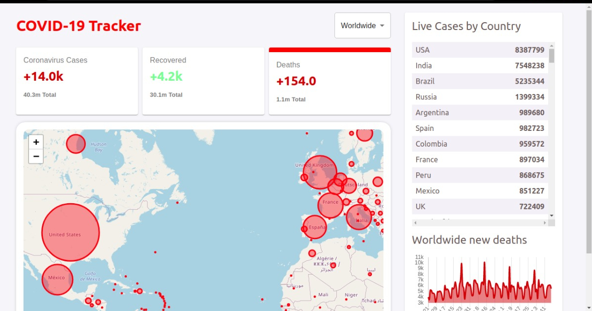
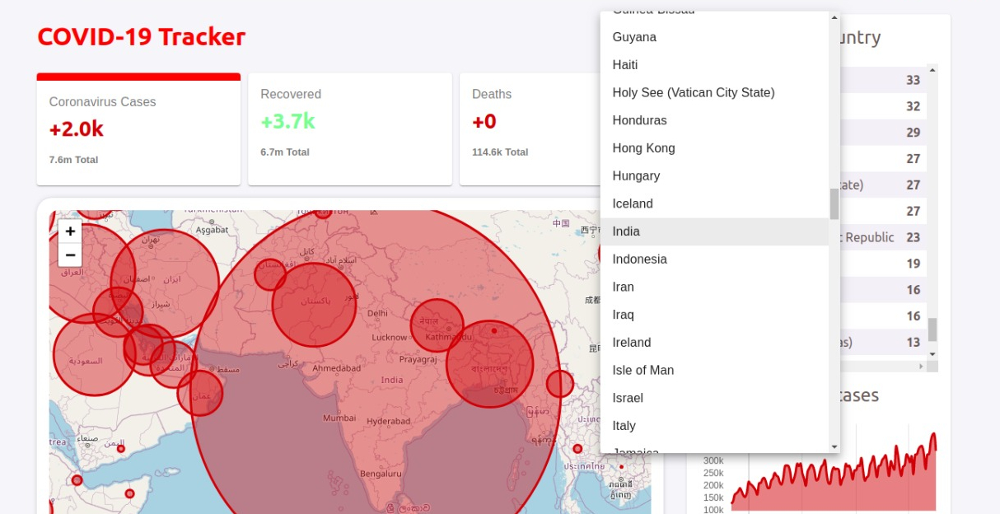
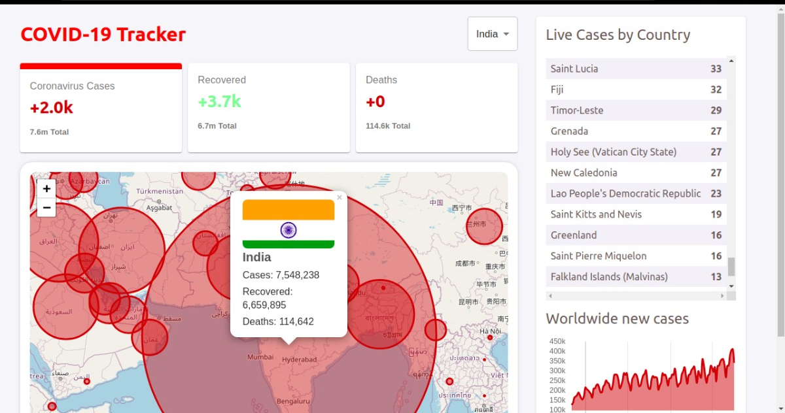
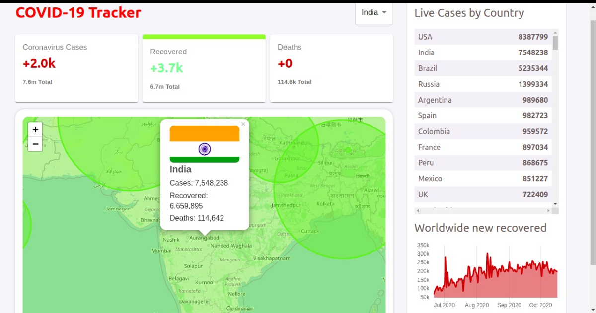
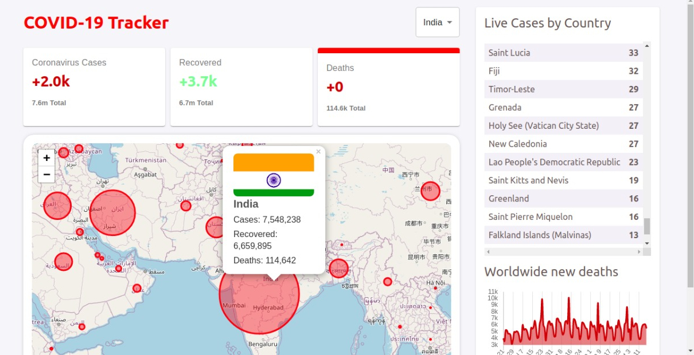
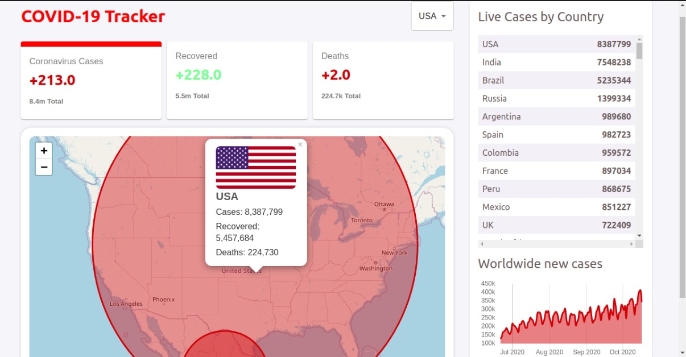
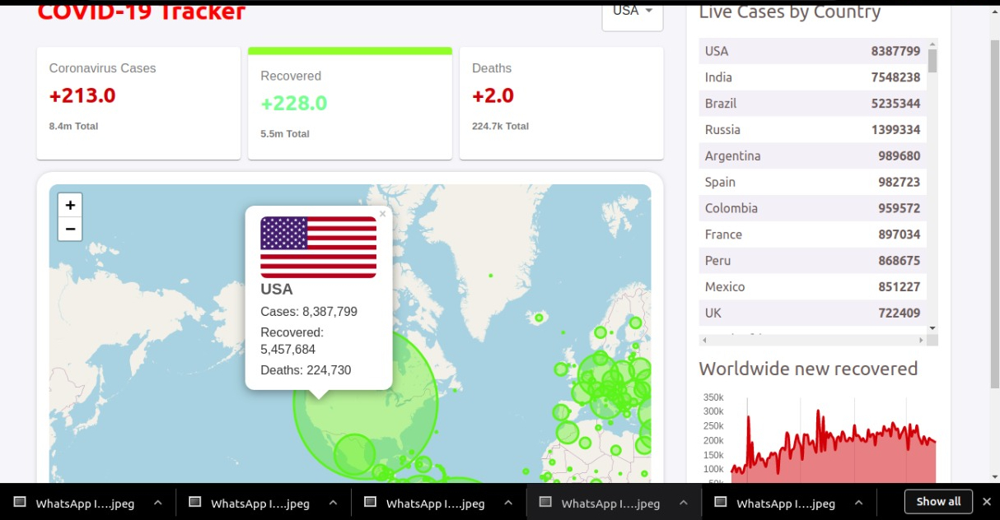
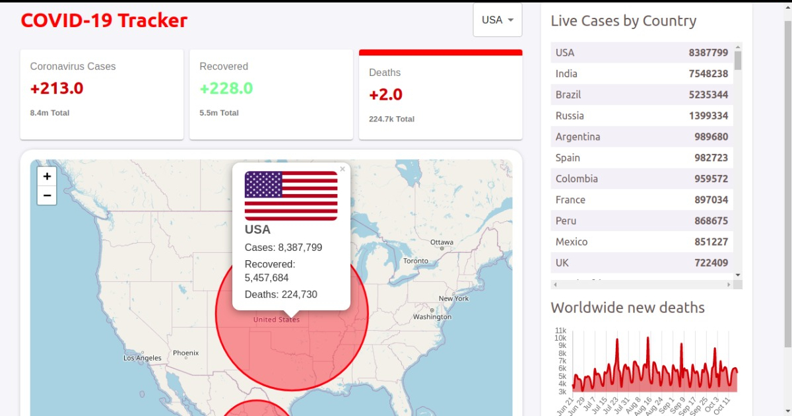

COVID-19 COUNTRYWISE TRACKER

this is a country wise covid 19 tracker web app ,created using React.js for frontend and chart.js open-source javascript library is used for data visualisation.
It shows 
1. The live active cases in the selected country
2. Live Recovered cases (with total number of recoverd cases)
3. Live death cases (with total number of death cases) and so on..
Furtherly Data visualisation is implemented using Chart.js(Maps,graphs) javascript library ,for better visualisation.

SCREENSHOTS OF COVID-19-TRACKER(this stats where taken on 19th october 2020 time-13-o4)

1.LANDING PAGE
   [world wide covid cases statistics]

2.WORLDWIDE recovered cases

3.WORLDWIDE death cases

4.A dropdown is provided to choose the country

[FOR EXAMPLE LETS SEE THE LIVE STATS OF INDIA AND USA ON 19-OCT-2020 13-04]

5.INDIA CASES (oct 19 2020 time-13-04)

5.INDIA RECOVERED (oct 19 2020 time-13-04)

5.INDIA DEATH (oct 19 2020 time-13-04)

5.USA CASES (oct 19 2020 time-13-04)

5.USA RECOVERED CASES (oct 19 2020 time-13-04)

5.USA DEATH CASES (oct 19 2020 time-13-04)

This project was bootstrapped with [Create React App](https://github.com/facebook/create-react-app).

## Available Scripts

In the project directory, you can run:

### `npm start`

Runs the app in the development mode. 
Open [http://localhost:3000](http://localhost:3000) to view it in the browser.

The page will reload if you make edits. 
You will also see any lint errors in the console.

### `npm test`

Launches the test runner in the interactive watch mode. 
See the section about [running tests](https://facebook.github.io/create-react-app/docs/running-tests) for more information.

### `npm run build`

Builds the app for production to the `build` folder. 
It correctly bundles React in production mode and optimizes the build for the best performance.

The build is minified and the filenames include the hashes. 
Your app is ready to be deployed!

See the section about [deployment](https://facebook.github.io/create-react-app/docs/deployment) for more information.

### `npm run eject`

**Note: this is a one-way operation. Once you `eject`, you can’t go back!**

If you aren’t satisfied with the build tool and configuration choices, you can `eject` at any time. This command will remove the single build dependency from your project.

Instead, it will copy all the configuration files and the transitive dependencies (webpack, Babel, ESLint, etc) right into your project so you have full control over them. All of the commands except `eject` will still work, but they will point to the copied scripts so you can tweak them. At this point you’re on your own.

You don’t have to ever use `eject`. The curated feature set is suitable for small and middle deployments, and you shouldn’t feel obligated to use this feature. However we understand that this tool wouldn’t be useful if you couldn’t customize it when you are ready for it.

